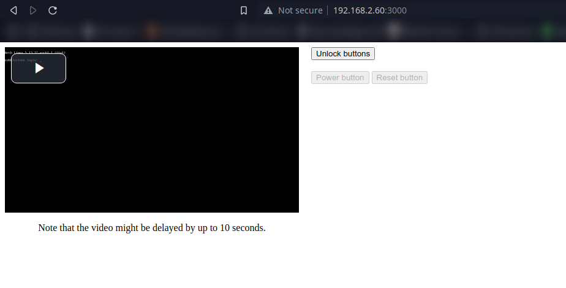

# Raspberry Pi based server remote monitoring
This project allows you to view and manage your server(s) in a "beautiful" dashboard. \
The buttons are directly hooked up to the server's power and reset buttons using the Raspberry Pi's GPIO pins. \
(USB HDMI capture device and a few transistors required) \

(setup instructions soon™)

# License
This project is licensed under the [AGPL 3.0](./LICENSE).
