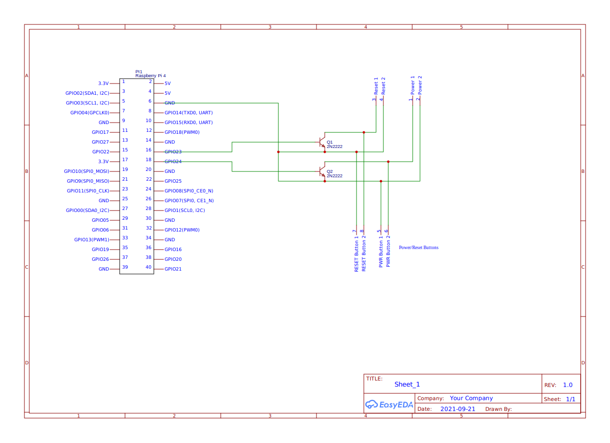

## Disclaimer
Use this at your own risk. Don't hold me responsible if you end up frying your hardware (Although this is highly unlikely).

# Setup

I assume that you already have Raspbian running on your Raspberry Pi and configured SSH or some other way to remotely access it. If not, set that up first.

## Hardware
You'll need:
- Raspberry Pi 4 (Older versions should work too, but might have trouble running ffmpeg)
- Breadboard, cables and a few 2N2222 transistors
- USB HDMI capture device
- A server or PC (Obviously)

### Wiring
The goal is to bridge the power/reset pins on your motherboard using transistors, which will be opened using the GPIO pins on the Raspberry Pi.

GPIO pin 23 should bridge the reset pins, while GPIO pin 24 should bridge the power pins. \
You can also hook up the power/reset buttons in your PC's case in parallel to the transistors to preserve their functionality.

Try to follow this diagram:

 \
The connectors labeled `Power/Reset buttons` represent physical buttons, while the connectors labeled `Power` and `Reset` at the top represent the connectors on your motherboard. \
(This Diagram should be accurate, but if it isn't please let me know.)

Once you're done, verify that it works by manually triggering the GPIO pins:

```bash
# Export the pins so that we can interact with them
echo 23 > /sys/class/gpio/export
echo 24 > /sys/class/gpio/export

# Set the correct pin mode
echo out > /sys/class/gpio/gpio23/direction
echo out > /sys/class/gpio/gpio24/direction

# This should simulate holding down the power button for one second.
echo 1 > /sys/class/gpio/gpio24/value && sleep 1 && echo 0 > /sys/class/gpio/gpio24/value

# Similarly, this should simulate short pressing the reset button.
echo 1 > /sys/class/gpio/gpio23/value && sleep 0.3 && echo 0 > /sys/class/gpio/gpio23/value
```

If it works, great! If it doesn't, double check if you plugged the transistors in the right way. (When looked at from the flat side, the right connector on a 2N2222 transistor is the emitter (Marked with an arrow in the diagram)).

Lastly, plug your HDMI capture device into an USB port on the Pi, and plug the server's video output into the capture device input. \
To verify that it works, run `ffprobe /dev/video0`. \
If the output ends like this, you should be fine:
```
Input #0, video4linux2,v4l2, from '/dev/video0':
  Duration: N/A, start: 165378.639189, bitrate: 165888 kb/s
    Stream #0:0: Video: rawvideo (YUY2 / 0x32595559), yuyv422, 1920x1080, 165888 kb/s, 5 fps, 5 tbr, 1000k tbn, 1000k tbc
```

Cram everything into your server's case, preferably without obstructing the airflow too much, and close it up.

## "Installing" the "Software"
Disclaimer: I know that this is probably a terrible way to do this, but it works for me ¯\\\_(ツ)\_/¯

Start by cloning this repository:
```bash
cd ~
git clone https://github.com/janderedev/raspi-server-monitor.git
cd raspi-server-monitor
```

Now move the files into the "correct" locations:
```bash
sudo cp *.service /etc/systemd/system/
sudo cp *.timer /etc/systemd/system/

sudo chmod +x *.sh

sudo cp ffmpeg-screenshot-stream.sh /root/
sudo cp ffmpeg.sh /root/

cp -r web-app ~/monitor-app
```

Now start these services:
```bash
sudo systemctl enable --now hls-stream-ffmpeg.service
sudo systemctl enable --now monitor-thumbnail.service
sudo systemctl enable --now monitor-thumbnail.timer
```

If everything went right, `/dev/shm/streaming/` should now contain a .m3u8 file and a few other files.

To run the web app, you will need node.js and a process manager (We will use pm2 in this example).
```bash
# Install node.js
sudo sh -c 'curl -sL https://deb.nodesource.com/setup_16.x | bash'
sudo apt-get install -y gcc g++ make nodejs

# Install pm2, yarn and typescript
sudo npm install -g pm2 yarn typescript

cd ~/monitor-app

# Install dependencies
yarn

# Set the password
echo "PASSWORD=changeme" > .env

# By default the server listens on port 3000. If you want to change the port, set the PORT env var:
echo "PORT=6969" >> .env
```

Now try if it works:
```bash
yarn start
```

Navigate to port 3000 on your raspi. Once you see the horrendous login prompt, enter the password you set. \
Check if the buttons and the video stream work. If it does, cool! If it doesn't, good luck debugging. (Hint: Check your browser's debug console)

Once you're done getting my terrible code to work, stop the server and start it using pm2 (Or whatever you use as process manager):
```bash
pm2 start "yarn start" --name "monitor"
pm2 save

# To start pm2 automatically at startup, run this and follow the instructions
pm2 startup
```

## Finishing words
Now that you (hopefully) got this to work, keep a few things in mind:
- If you plan on exposing this to the internet, put it behind a reverse proxy and use SSL. \
The plain text password is sent as a cookie with every request, which makes it easy for an attacker to yoink it just by looking at your HTTP traffic - And you probably don't want a stranger to be able to remotely reset or view your PC.
- This software is experimental - In case you decide to use this for some reason, please don't hesitate to report issues.
